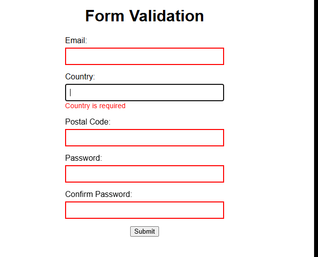
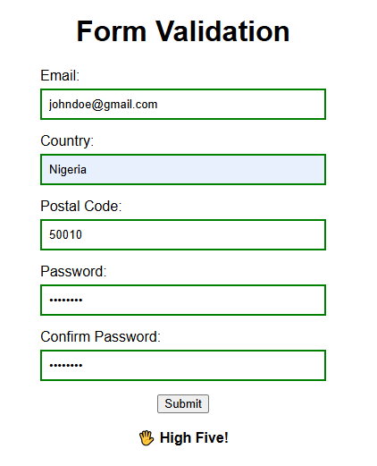

# 🖐 Form Validation Project

This project is a simple browser-based form that collects Email, Country, Postal Code, Password, and Password Confirmation fields.
It features live inline validation using JavaScript and gives users real-time feedback on their input.

## Table of Content

* [Featutes](#fearures)
* [Setup](#setup)
* [Project structure](#project-structure)
* [Technologies used](#technologies-used)
* [Validation rules](#validation-rules)
* [Contributions](#contributions)
* [Contact](#contact)

## 🚀 Features

- **Live validation** – Each field is validated when the user leaves it (on blur).
- **Inline error messages** – Users are informed of issues directly below each field.
- **Visual feedback** – Fields are highlighted: ✅ Green when valid, and ❌ Red when invalid
- **Custom form submission handling** – The form does not actually submit, but if all fields are valid, the user gets a High Five!
- **No browser default validation** – We use our own validation with novalidate.

## 📸 Preview

## 🛠️ Setup

### 1️⃣ Clone the Repository

- git clone https://github.com/hencci/validate-form.git
- cd validate-form
- Open index.html

## 📂 Project Structure

validate-form/  
│── images/  
│── index.html/  
│── README.md  
│── script.js  
│── styles.css  

## ✨ Technologies Used

- JavaScript (ES6+)
- CSS for styling
- HTML for the base structure

## 📝 Validation Rules

- Field&nbsp;--&nbsp;&nbsp;&nbsp;&nbsp;	Validation Criteria
- Email&nbsp;--&nbsp;&nbsp;&nbsp;&nbsp;	Must be a valid email format (e.g., user@example.com)
- Country&nbsp;--&nbsp;&nbsp;	Cannot be empty
- Postal Code&nbsp;--&nbsp;&nbsp;	Must be 5 digits or 5 digits + 4 (e.g., 12345 or 12345-6789)
- Password&nbsp;--&nbsp;&nbsp;	Minimum 8 characters
- Confirm Password&nbsp;--&nbsp;&nbsp;	Must exactly match the password

## 🙌 Acknowledgments

Project inspired by The Odin Project's Form Validation lesson
https://www.theodinproject.com/lessons/javascript-form-validation

## 📜 License

This project is open-source and available under the MIT License.

## 💡 Contributions

Feel free to fork this repository and improve the project! 🚀
PRs are welcome! 😊

## Live preview

https://hencci.github.io/validate-form

## Contact

Created by [Henry Moses](https://github.com/hencci)
Feel free to reach out if you have any questions